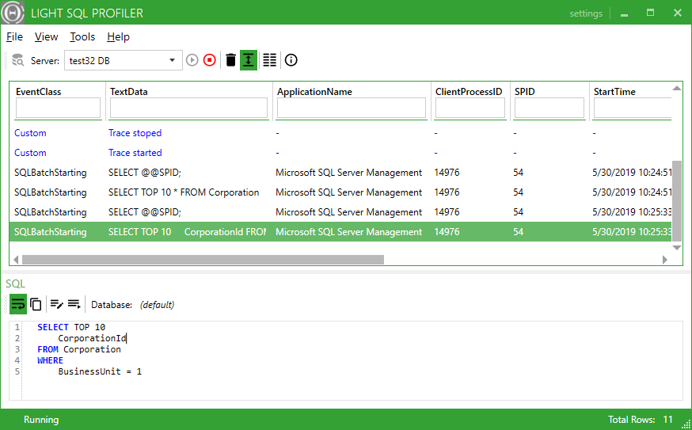

## Light SQL Profiler

*Light SQL Profiler is a lightweight yet fully fledged MS SQL Server profiler tool written in .NET framework.*

Project aims for an easy-to-use, quick setup, and show-me-what's-important approach.

### Install
[Download](https://github.com/rexem/LightSqlProfiler/releases) and run the latest installation file.

Direct download: [LightSqlProfilerSetup-1.0.exe](https://github.com/rexem/LightSqlProfiler/releases/download/v1.0/LightSqlProfilerSetup-1.0.exe)

### Features

- Supports all MS SQL Server profiling events and data columns
- Allows executing and re-executing SQL queries directly
- Quick filtering and search
- Light on resources
- Open source

### Screenshot



### Compiling

To build an application from source, use:
```bash
git clone https://github.com/rexem/LightSqlProfiler
cd LightSqlProfiler
msbuild /property:Configuration=Release LightSqlProfiler.sln
```
